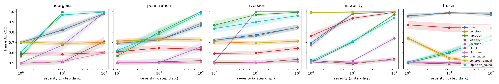

# Learned physics vs. vision vs. rules for anomaly detection in FE simulations

**When does a learned physics surrogate catch simulation failures that simple rules and generic vision models miss,
and can a VLM explain the flagged frames correctly?**

Contributions: (i) an injected-failure benchmark on FE meshes, with ground-truth type and location for every
anomaly; (ii) a quantified comparison of three detector families: a learned surrogate, physics-free rules
(constant-velocity extrapolation, Laplacian smoothness, inverted-element check, velocity z-score) and CLIP;
(iii) a correctness study of VLM explanations against a diagnostics-only classifier. Residual-based fault detection
with a surrogate is a classical digital-twin idea. What is new here is the controlled comparison and the explanation
study, not the detector itself.

A MeshGraphNet ([Pfaff et al., ICLR 2021](https://arxiv.org/abs/2010.03409)) is trained on DeepMind's
`deforming_plate` dataset (an actuator pressing into a hyperelastic plate; COMSOL, tetrahedral FE meshes). This is the
a public structural-mechanics benchmark. It is quasi-static and hyperelastic, which makes it a stand-in for crash
data rather than the real thing. Synthetic failures modelled on real FE failure modes are injected
into held-out simulations. Three kinds of detector are compared:

- the surrogate's one-step prediction error
- physics-free baselines
- CLIP-based image anomaly detection

A VLM then explains the flagged frames. Its answers are scored against the injected ground truth for type and exact
location, and compared with a decision tree trained on the numeric diagnostics alone. This measures correctness, not
full explanation faithfulness: free-text claims are not yet checked.

Runs end to end on a MacBook (M4 Pro, 24 GB): plain PyTorch on MPS, MLX for the VLM, no TensorFlow.

## Pipeline

```
TFRecords --stream--> .npz ──> MeshGraphNet (one-step surrogate, trained overnight on MPS)
                                   │
held-out sims ──inject 5 failure modes x 3 severities──> corrupted sims
                                   │
            ┌──────────────┬───────┴────────┬─────────────────────┐
  GNN residual  const-velocity  Laplacian  inverted-tet  velocity z  CLIP zero-shot / patch-kNN
            └──────────────┴───────┬────────┴─────────────────────┘
  frame/node AUROC, TPR@5%FPR, paired bootstrap of GNN - baseline
                                   │
     flagged frames ──render + residual heatmap (+ mesh diagnostics)──> Qwen3-VL (JSON) ──> vs. diagnostics-only tree
```

## Injected failure modes

| Injected anomaly | Crash-simulation failure it mimics | How |
|---|---|---|
| hourglass | hourglassing / zero-energy modes in under-integrated elements | checkerboard offsets (alternating by hop parity) on a 2-hop patch |
| penetration | contact failure | plate nodes touching the actuator (<1 mm) moved to the closest point on its surface, then pushed inward by the severity depth (checked: 100/100/92% of them end up inside the actuator) |
| inversion | element inversion (negative Jacobian) | one tet vertex moved towards its opposite face (severity 1 distorts without flipping; 2 and 3 invert) |
| instability | numerical blow-up | local sign-alternating oscillation growing 1.6x per frame for 8 frames, peaking at the severity amplitude |
| frozen | constraint / boundary-condition error | a region holds its position while the plate keeps deforming |

Severities are 1x, 10x and 100x the simulation's RMS per-step node displacement (≈0.3 mm). Inversion is geometric
(0.3x, 0.6x, 1.5x the reflection distance), and for frozen the severity is the duration (3, 10, 30 frames).
Penetration events start only once the actuator is in contact with the plate.

## Evaluation protocol (frozen before the final test run)

Everything below is fixed on validation simulations before test simulations 8–99 are scored, once:

- **Data.** Validation sims 0–19 serve as CLIP reference renders and training-time validation. Sims 20–99 are used
  for tuning and gates. Test sims 0–7 were used in pilot runs and are excluded, leaving 92 test sims.
- **Frames (protocol v2).** Every anomalous frame is scored and labelled `onset` (first frame) or `sustained`. Clean
  frames are drawn from the same copy within ±40 frames of the event, outside a ±3-frame guard band, so clean and
  anomalous frames come from the same loading phase.
- **Statistics.** 95% bootstrap CIs over simulations, and none are reported with fewer than 20 sims. Paired
  bootstrap for GNN-minus-baseline differences. TPR at 5% FPR. AUROC is reported per event phase.
- **Gates.** A: σ is chosen on validation (pre-registered criterion). B: the surrogate's one-step error vs
  constant velocity. C: the GNN must beat the best baseline (chosen per cell on validation) with a paired CI that
  excludes 0 before any claim of benefit.
- **Provenance.** Every records file stores the checkpoint SHA-256, the simulation IDs, the protocol version and the
  git commit.

## Results

All numbers are on **92 held-out test simulations (8–99), scored once** with the frozen protocol (commit
`3ff1e07`, checkpoint `b917f77f`, 258.6k steps). 95% CIs are bootstrapped over simulations. Full tables are in
[results/test/metrics.md](results/test/metrics.md) and [results/test/gate_c.md](results/test/gate_c.md).

### TL;DR
1. **Some simple rule matches or beats the GNN in every cell.** The GNN's only test-set win was frozen regions
   (sustained-frame AUROC 0.99, against 0.63 for the position Laplacian and 0.51 for inverted elements). That led to
   the post-hoc reading "learned physics catches kinematic, not geometric, errors". A later **post-hoc, validation-only
   check refutes it** ([scripts/posthoc_vlap_check.py](scripts/posthoc_vlap_check.py), validation sims 20–49, the same
   corrupted copies). A one-line *velocity* Laplacian (a node's velocity minus its neighbours' mean) scores 1.00 on
   sustained frozen frames at every severity, against the GNN's 0.97–0.99. That rule wasn't in the pre-registered
   pool, so Gate C stands as reported, but the taxonomy claim doesn't. Phase 2 (in progress) tests the one case where
   learned physics should still be needed: runs that are smooth everywhere but inconsistent with the loading.
2. **Across the other types, simple rules match or beat the GNN.** Constant-velocity extrapolation is near-perfect at the
   onset of every anomaly. Spatial checks (Laplacian smoothness, inverted elements) beat the GNN on persistent
   hourglass, penetration and inversion.
3. **The pre-registered Gate C gives a split result.**
   - The non-causal GNN shows **no demonstrated benefit** over the best non-causal baseline: −0.058, 95% CI [−0.073, −0.042].
   - The causal GNN, used as an online monitor, **beats the best causal baseline**: +0.023 [+0.006, +0.040]. That win
     comes entirely from frozen regions (+0.22 to +0.38 AUROC, Holm-significant). Part of that margin is because the
     pre-registered causal pool has no past-only velocity z-score, which would be easy to build. The frozen advantage
     doesn't depend on it, though: the non-causal GNN also beats the non-causal velocity z-score on frozen by +0.09
     to +0.15 (Holm-significant).
4. **CLIP is near chance even on visible failures.** It stays at 0.51–0.53 for penetration and inversion at a 16–20 px
   shift in the 448 px render, which is about half a 16 px patch at CLIP's 224 px input. Its reference bank also comes
   from other simulations' geometries.
5. **The VLM doesn't explain better than the numbers it's given.** From images alone, Qwen3-VL-8B called 199 of 200
   frames "none": 0% type accuracy on anomalies at *every* severity, including severity 3. With diagnostics it
   reaches 26%. A depth-4 decision tree, cross-validated on the same diagnostics, reaches 55%.

### Detection: onset vs. sustained frames
Frame AUROC, averaged over the three severities:

| anomaly | phase | GNN | const-velocity | Laplacian | velocity z | inverted-tet | CLIP kNN |
|---|---|---|---|---|---|---|---|
| hourglass | onset | 1.00 | 1.00 | 0.85 | 0.97 | 0.72 | 0.57 |
| hourglass | sustained | 0.79 | 0.62 | **0.85** | 0.50 | 0.72 | 0.57 |
| penetration | onset | 0.99 | 1.00 | 0.79 | 0.93 | 0.56 | 0.52 |
| penetration | sustained | 0.70 | 0.66 | **0.79** | 0.55 | 0.55 | 0.51 |
| inversion | onset | 1.00 | 1.00 | 0.94 | 0.99 | 0.84 | 0.52 |
| inversion | sustained | 0.73 | 0.63 | **0.94** | 0.52 | 0.84 | 0.51 |
| instability | onset | 0.81 | **0.99** | 0.61 | 0.77 | 0.51 | 0.50 |
| instability | sustained | 0.90 | **1.00** | 0.74 | 0.92 | 0.60 | 0.52 |
| frozen | onset | 0.94 | **1.00** | 0.48 | 0.86 | 0.50 | 0.50 |
| frozen | sustained | **0.99** | 0.49 | 0.63 | 0.85 | 0.51 | 0.50 |

Regenerate with `scripts/phase_table.py`. Constant velocity (the GNN with zero learned output) collapses on sustained
frames of the persistent anomalies, as hypothesized, and the GNN recovers part of that gap. Instability is the
exception: constant velocity never collapses there and beats the GNN in both phases. Only for frozen regions does
the GNN beat every alternative.



### Surrogate quality (Gate B)
On fixed validation frames, the one-step RMSE is 4.85e-5 against 7.0e-6 for constant velocity. The noise-trained
surrogate is **6.9× worse than "do nothing" on clean data.** It is a denoiser that detects states which don't relax
back to equilibrium, not a better simulator. That is also why it trails constant velocity at anomaly onset and on
small instabilities.

### Lead time (causal detectors; thresholds at 95% specificity set on validation)
The blow-up ramps 1.3× per frame from each simulation's clean-acceleration floor to a 100× cap, over about 45 frames.

| detector | blow-up: median warning before cap (frames) | detected | frozen: latency (frames) | detected | false-alarm rate |
|---|---|---|---|---|---|
| const-velocity (causal) | **39** [37–41] | 100% | 0 | 100% | 6.2% / 3.1% |
| GNN (causal) | 18 [18–19] | 100% | 0 | 93% | 1.1% / 2.3% |
| Laplacian (causal) | 7 [6–8] | 100% | 10.5 | 30% | 5.1% / 8.7% |
| inverted-tet | 6 [5–7] | 96% | 23 | 14% | 0% |

For early warning of a growing instability, the second-difference rule is the best tool. The GNN's higher noise
floor costs it about 20 frames of warning.

### VLM explanations (200 test frames, sampled without regard to detection)
[results/vlm_metrics.md](results/vlm_metrics.md), [confusion matrices](results/vlm_confusion.png)

| arm | type accuracy | macro-F1 | exact location cell |
|---|---|---|---|
| VLM, images only | 12% | 0.04 | 55% |
| VLM, images + diagnostics | 26% | 0.18 | 41% |
| decision tree on diagnostics (supervised, 5-fold CV on these frames) | **55%** | **0.55** | **79%**¹ |
| majority class / majority cell | 18% | 0.05 | 49% |

¹ The tree predicts only the type. Its location is the diagnostics' hotspot cell, copied directly. The VLM is
zero-shot. Split by severity, image-only type accuracy on anomalous frames is 0% at severities 1, 2 and 3 (n = 48, 53,
74), and with diagnostics it is 10%, 32% and 20%. Clean frames are called "none" 100% of the time from images and 60%
with diagnostics, where the VLM labels 72% of all frames "instability".

**Counterfactual pairs** (40 pairs; A = a clean, strongly bent frame, B = the same frame plus a severity-3 hourglass,
median visible shift 17 px; [results/counterfactual.md](results/counterfactual.md)):
- From the render alone, the VLM called **every** B frame "none". It never saw the hourglass.
- With the heatmap, it still called every B frame "none".
- With diagnostics, it separated 78% of the pairs, but labelled B as "instability" or "inversion", never "hourglass".
- Its explanations of A and B overlap about as much as explanations of unrelated frames (term Jaccard 0.25 vs 0.24).

The fluent text is not grounded in what it sees. For engineering sign-off, this is an automation-bias risk rather
than an explanation.


## Phase 2 (validation-stage results; the replication set is not scored yet)

Technical report: [docs/report/report.pdf](docs/report/report.pdf) (Typst source alongside).

- **Complete rule pool.** A velocity Laplacian, a past-only velocity z-score and a contact rule (penetration depth) are
  now in every detector pool (protocol v3).
- **Gate D, whole-run loading errors: FAIL** ([docs/gate_d.md](docs/gate_d.md),
  [results/runlevel/gate_d.md](results/runlevel/gate_d.md)). The errors are response scale, lag and time scale.
  - The shape-from-load surrogate missed its admission bar: RMSE 1.99 cm against 3.18 cm for zero displacement.
  - The velocity GNN never beats the best rule.
  - Contact rules catch scale (0.85–1.00), timescale (0.92–1.00) and 10-frame lag (0.91).
  - **A 1–3 frame lag is undetectable by every method (AUROC 0.47–0.58).**
- **Gate V, vision backbones × resolution: FAIL** ([docs/gate_v.md](docs/gate_v.md),
  [results/gate_v/gate_v.md](results/gate_v/gate_v.md)). No condition reaches AUROC 0.80 at severity 3.
  - The conditions were CLIP B/16, OpenCLIP L/14 and DINOv2-L patch-kNN, and CLIP and SigLIP2 zero-shot.
  - DINOv2-L is the best (mean 0.65; hourglass 0.88).
  - An 896 px plate crop doesn't help, so the limit is the modality, not the resolution.
- **Gate E pilot, a larger same-family VLM (Qwen3.8-27B via OpenRouter free tier): running**
  ([docs/gate_e_pilot.md](docs/gate_e_pilot.md)).
- **Seed robustness.** A second full-scale seed of the velocity surrogate reproduces the clean one-step error
  (4.73 vs 4.85 ×10⁻⁵).
- **Conformal run-level alarms.** Implemented, but on validation the false-alarm rate exceeded the nominal α (up to
  30% at α = 10%), so no guarantee is claimed yet.

## Design notes (what mattered)

- **MGN in plain PyTorch.** Aggregation uses `index_add_`, with two edge sets (mesh plus actuator↔plate contact edges
  within 3 cm), 10 message-passing steps and latent size 128, for 2.6M parameters. PyG's scatter extensions have no MPS
  kernels, and the model is about 80 lines anyway.
- **Velocity in, acceleration out.** The first version followed the paper's deforming-plate setup (positions in,
  displacement out, noise σ=3e-3). It failed to beat a zero-motion baseline within a laptop budget, because plate
  motion is tiny (~3e-4 per step) relative to edge lengths (~2e-2), so it only shows up as ~1e-4 strain signals.
  Switching to the MGN-cloth formulation fixed this: current velocity as a node input, acceleration as the target.
  A constant-velocity extrapolation then becomes the model's zero-output baseline, and it is reported as a detector
  in its own right. This makes the comparison honest: the GNN has to beat that baseline, not just a straw man.
- **Training noise is what makes the surrogate a detector.** A surrogate trained only on clean data learns "keep
  going at the same velocity", which is just the constant-velocity baseline. It flags the *onset* of a persistent
  anomaly, but not the frames after it, because the corrupted motion is smooth again by then. When noise is added to
  the input positions and the target keeps the clean next state, the model learns to pull perturbed states back to
  equilibrium. Inverted elements, frozen regions and hourglass patterns then leave a residual in *every* frame, since
  the observed simulation never relaxes back.

  The noise level sets a trade-off between that sensitivity and the error floor on clean data. For reference, the
  constant-velocity extrapolation's own one-step RMSE on clean frames is about 3e-6, so a noise-trained surrogate is
  15–70× *worse* than "do nothing" on clean data. It is a denoiser, not a better simulator.

  An early pilot chose σ on test simulations. That was a mistake, and the pilot was confounded: its runs differed in
  training-set size and calibration. So σ was re-checked on validation simulations (Gate A,
  pre-registered in [docs/gate_a.md](docs/gate_a.md)). At equal budget (40 train simulations, ~9k steps), σ=3e-4
  beats σ=1e-3 on mean GNN frame AUROC over hourglass, inversion and frozen: 0.83 vs 0.72, paired difference −0.105,
  95% CI [−0.129, −0.077], 30 validation simulations. So σ=3e-4 stays.
- **Steady-actuator regime only.** In every trajectory the actuator speeds up about 9x around frame 360. We train and
  score on frames under 350.
- **MPS shape bucketing.** Batches are padded to fixed node and edge buckets. Without this, every new graph size
  compiles a new Metal kernel graph, and step time climbed from 110 to 330 ms within minutes.
- **No TensorFlow.** TFRecord framing and `tf.train.Example` are parsed by hand in about 30 lines, and the data is
  streamed, so only the first 250 of the 1,000 training simulations are downloaded.
- **Evaluation protocol.** Each corrupted copy contributes up to 4 anomalous frames and 4 clean frames, taken from
  outside a ±3-frame guard band. Residual detectors are calibrated per node, without supervision, by their median
  over every 10th frame of the same simulation. That calibration uses future frames, which is fine for
  benchmarking but not valid for early-warning claims. CIs are 95% bootstrap intervals resampled over simulations,
  and GNN-vs-baseline differences use a paired bootstrap. The render column `px` gives the median visible shift of
  each anomaly in pixels, so "CLIP misses it" can be told apart from "it is sub-pixel".
- **Node AUROC below 0.5** (e.g. constant velocity on `frozen`) is not a bug. Frozen nodes have *lower* residuals
  than moving ones, and scores are one-sided.

## Reproduce

```bash
uv sync
uv run python -m mgn.data valid -n 100 && uv run python -m mgn.data test -n 100 && uv run python -m mgn.data train -n 250
uv run python -m mgn.train --name mgn --hours 8 --iters 260000      # ~110 ms/step on M4 Pro (sigma=3e-4 default)
scripts/after_training.sh <training PID>   # frozen protocol: Gate B, validation, single test run, Gate C,
                                           # lead time, VLM, counterfactuals (~2 h on M4 Pro)
uv run python scripts/phase_table.py       # onset-vs-sustained table below
uv run pytest
```

## Limitations and next steps

- Injected anomalies are additive, and the trajectory snaps back to the clean one afterwards, so it is not a
  self-consistent physical state. `frozen` at severity 1 (3 frames) is close to imperceptible.
- Single training seed, one dataset, one VLM (4-bit). The training-noise ablation is the only model ablation.
- `deforming_plate` is quasi-static and hyperelastic. Real crash simulations are explicit-dynamics, with plasticity,
  failure and self-contact. The failure modes here are injected, not produced by a solver.
- A laptop-scale surrogate (about 8 h, 250 simulations) is far from paper scale (8×H100, 20 h). Its one-step error
  sets the detection floor for subtle anomalies.
- Next steps: detection lead time with causal calibration and a growing instability; matched counterfactual
  pairs (clean high-stress frame vs. injected hourglass) for explanation faithfulness; checking claims in the
  free-text explanations; a larger or unquantised VLM; longer training and multi-scale or transformer processors (e.g. MGN-Transformer) for global
  consistency, solver-generated failures (e.g. reduced-integration runs that really hourglass), and a VLM fine-tuned
  on the diagnostics.
